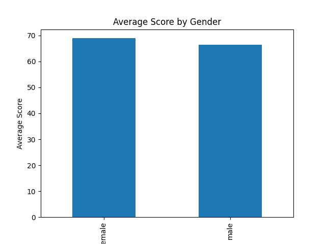
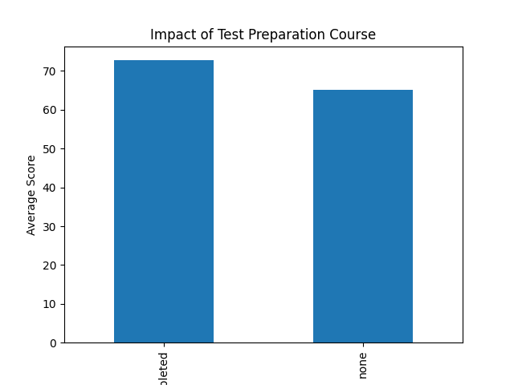
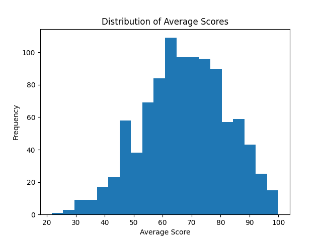

Student Performance Analytics System
📌 Project Overview

This project analyzes student exam performance data using Python and SQL.
It implements a complete data pipeline from raw dataset ingestion to database storage and analytical visualization.

🛠 Tech Stack

Python

Pandas

SQLite

SQL (GROUP BY, ORDER BY, Subqueries)

Matplotlib

⚙ Features

Data cleaning and transformation

Feature engineering (average score calculation)

Relational database storage

SQL-based analytical queries

Performance trend visualizations

End-to-end automated execution

📊 Key Insights

Female students have slightly higher average scores than male students.

Students who completed test preparation perform significantly better.

506 students scored below overall average.

Top-performing students achieved near-perfect scores.

▶ How to Run

Install dependencies:

pip install -r requirements.txt

Run the full system:

python main.py

 ## 📊 Project Visualizations

### 1️⃣ Average Score by Gender

### 2️⃣ Impact of Test Preparation

### 3️⃣ Score Distribution
